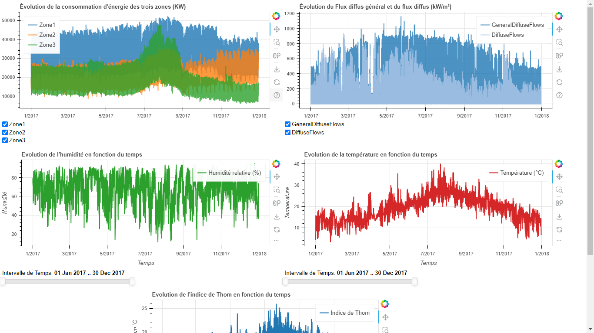
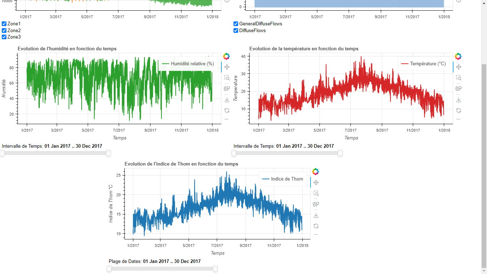

# Dashboard de Consommation Électrique de Tétouan

## Description du Projet

Ce projet présente un dashboard interactif développé avec Bokeh pour analyser la consommation électrique de la ville de Tétouan au Maroc. Le dashboard permet de visualiser et d'analyser les données de consommation électrique collectées par le système SCADA d'Amendis, l'opérateur de service public chargé de la distribution d'eau potable et d'électricité depuis 2002.

### Contexte

La consommation d'énergie au Maroc est un enjeu crucial, avec une consommation par habitant de 0,56 tep (environ 42% en dessous de la moyenne de l'Afrique du Nord). Le réseau de distribution électrique de Tétouan est alimenté par 3 stations de zone : Quads, Smir et Boussafou.

### Données Analysées

Le dataset couvre la période du 1er janvier 2017 au 1er janvier 2018, avec des mesures prises toutes les 10 minutes, incluant :

- **Données de Consommation** :
  - PowerConsumption_Zone1 (kW)
  - PowerConsumption_Zone2 (kW)
  - PowerConsumption_Zone3 (kW)

- **Données Météorologiques** :
  - Température (°C)
  - Humidité relative (%)
  - Vitesse du vent (m/s)
  - Flux de rayonnement diffus général (kW/m²)
  - Flux de rayonnement diffus spécifique (kW/m²)

## Fonctionnalités du Dashboard

Le dashboard comprend plusieurs visualisations interactives :

1. **Graphique de Consommation d'Énergie** :
   - Affichage de la consommation des trois zones
   - Sélection interactive des zones à afficher via des checkboxes

2. **Graphique des Flux de Rayonnement** :
   - Comparaison entre le flux diffus général et spécifique
   - Contrôles interactifs pour la sélection des flux

3. **Suivi de l'Humidité** :
   - Évolution temporelle de l'humidité relative
   - Slider temporel pour zoomer sur des périodes spécifiques

4. **Monitoring de la Température** :
   - Évolution de la température au fil du temps
   - Sélection de plages temporelles pour analyse détaillée

5. **Indice de Thom** :
   - Calcul et affichage de l'indice de confort thermique
   - Visualisation centrée avec contrôle temporel

## Installation et Utilisation

1. Cloner le repository :
```bash
git clone https://github.com/Abderrahmane-dotcom/Bokeh-app.git
```

2. Installer les dépendances requises :
```bash
pip install pandas bokeh
```

3. Lancer l'application :
```bash
python apk.py
```

L'application génèrera un fichier HTML (`visualisation.html`) qui s'ouvrira automatiquement dans votre navigateur par défaut.

### Captures d'Écran du Dashboard

Pour visualiser le dashboard en action, exécutez le script et accédez aux visualisations interactives suivantes :

1. Vue globale montrant la consommation d'énergie des trois zones
2. Graphiques des paramètres météorologiques en temps réel
3. Analyse de l'indice de confort thermique (Thom)




## Auteurs

- Kaddouri Oussama
- Jabiri Abderrahmane

## Licence

Ce projet est sous licence open source.
